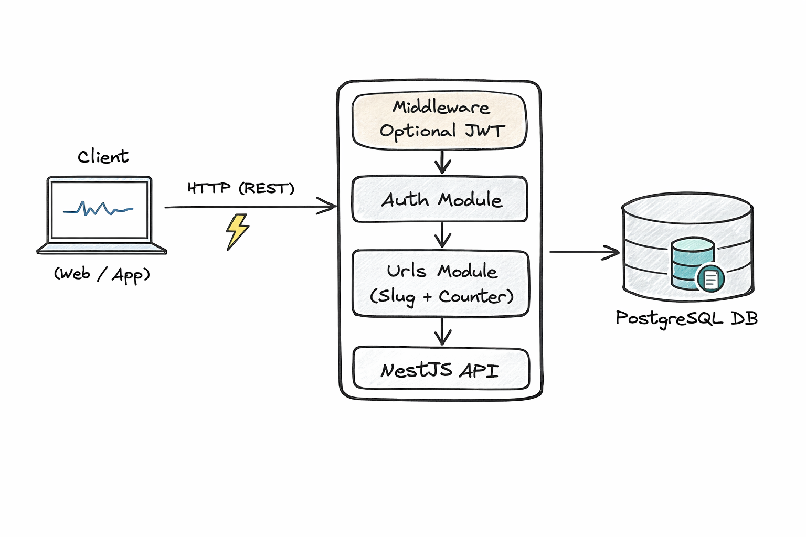

# URL Shortener API

API RESTful para encurtamento de URLs construída com **NestJS**, **TypeScript**, **PostgreSQL** e **Docker**.

---

# URL Shortener — Como executar e Escalabilidade


## Como rodar a aplicação


Antes de tudo, clone o repositório e entre na pasta do projeto:

```bash
git clone https://github.com/Gquaresma/url-shortner.git
cd url-shortner
```

Pré-requisitos mínimos:


Opção A — Com Docker (recomendado)

1. Copie o arquivo de ambiente:

```bash
cp .env.example .env
```

2. Suba os containers:

```bash
docker-compose -f docker-compose.dev.yml up -d --build
```

3. Acesse a API em http://localhost:3000 e Swagger em http://localhost:3000/docs

> Para testar rapidamente o funcionamento da aplicação basta abrir o Swagger (`http://localhost:3000/docs`) — ele lista todos os endpoints e permite executar requests diretamente.

Parar e remover containers

Se quiser derrubar os containers criados pelo compose use:

```bash
docker-compose -f docker-compose.dev.yml down
```
Opção B — Sem Docker

1. Instale dependências:

```bash
npm install
```

2. Crie o banco PostgreSQL (ex.: usando psql):

```sql
CREATE DATABASE shorturl;
```

3. Copie variáveis de ambiente:

```bash
cp .env.example .env
```

4. Rode a aplicação em modo de desenvolvimento:

```bash
npm run start:dev
```

---

## Escalabilidade em produção (horizontal e vertical)

Objetivo

Manter baixa latência e alta disponibilidade para dois padrões principais de carga:
- Leituras massivas: redirecionamentos (hot path)
- Escritas esporádicas/picos: criação/atualização de URLs

1) Escala horizontal (recomendada)

- Deploy em orquestrador (Kubernetes / ECS) com várias réplicas da API atrás de um Load Balancer (NGINX / ALB / Cloud LB).
- Manter a API stateless (JWT) para que qualquer réplica responda às requisições.
- Autoscaling: HPA baseado em CPU, latência, ou métricas customizadas (por exemplo, filas ou uso de CPU por worker).
- Infra de suporte: Redis (cache, rate-limit), fila (BullMQ / RabbitMQ / SQS), connection pooler (PgBouncer).

Vantagens
- Elasticidade, tolerância a falhas, manutenção de disponibilidade durante deploys.

Riscos e mitigação
- Estado distribuído (contadores/locks): usar Redis com flush em batch para o DB.
- Explosão de conexões ao Postgres: usar PgBouncer; limitar conexões por pod.

2) Escala vertical

- Aumentar CPU/Memória do banco ou nós de aplicação.
- Adequado para picos curtos ou quando o custo de rearquitetura horizontal não é justificável imediatamente.

Limitações
- Fronteiras físicas, custo crescente, não resolve single-point-of-failure.

3) Banco de dados (Postgres)

- Arquitetura sugerida: Primary (writes) + Read Replicas (reads).
- Usar PgBouncer/Pooler para evitar exaustão de conexões em ambientes com muitas réplicas.
- Estratégias avançadas: particionamento (partitioning/sharding) quando a base crescer muito.

Pontos críticos e soluções práticas
- Contadores de acesso de alta taxa: manter contagem em Redis e realizar batch upserts periódicos (p.ex. via worker) ao Postgres.
- Unicidade de slugs: ter constraint UNIQUE no DB e gerar slugs de forma atômica (Redis INCR + base62, ou sequência no DB com retry). Sempre tratar erros de colisão com retry idempotente.

4) Cache e rate limiting

- Cachear redirecionamentos e metadados em Redis (ou CDN para conteúdo muito estático) com TTLs curtos/medianos.
- Rate limiting distribuído implementado em Redis para proteger contra abuso e DDoS.

5) Filas e workers

- Offload: envio de e-mails, processamento de métricas, flush de contadores e tarefas de I/O pesado.
- Filas escaláveis (RabbitMQ / SQS) com workers separadas que escalam independentemente da API.

6) Observabilidade e resiliência

- Health checks (readiness/liveness) para orquestradores.
- Métricas (Prometheus), logs estruturados e tracing (OpenTelemetry).
- Circuit breakers, timeouts e retry policy em chamadas externas.

Checklist operacional para promover ao ambiente de produção

- Usar serviços gerenciados (Managed Postgres, Managed Redis) quando possível.
- Configurar backups automáticos e testes de restore.
- Implementar CI/CD com pipelines
- Habilitar monitoramento e alertas (latência, erros, filas, uso de conexões DB).
- Configurar secrets management e políticas de acesso.

Diagrama da atual arquitetura




